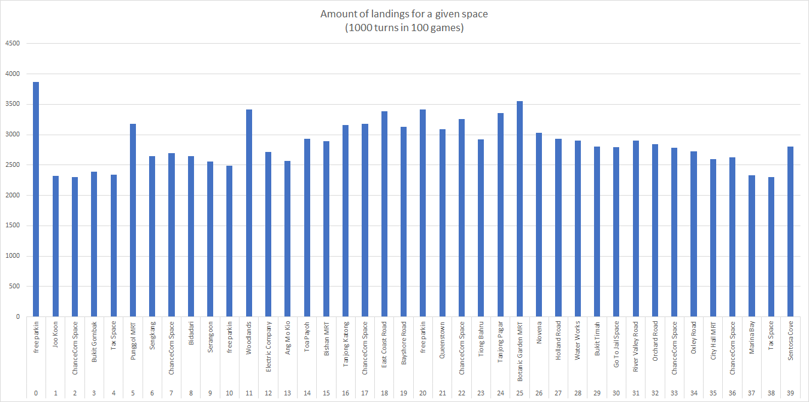
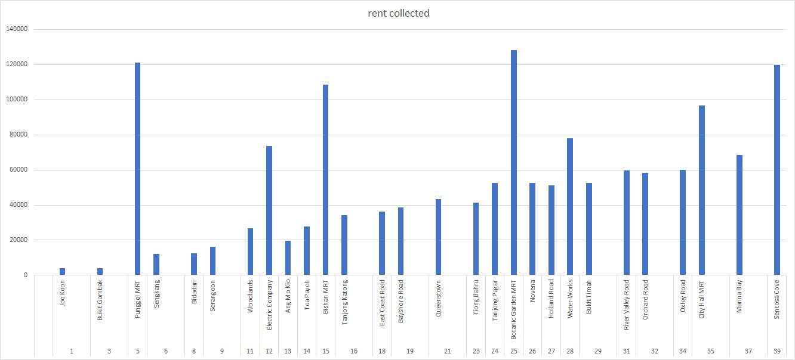

# TODO
1. Replace the images in the readme. Disgusting.
2. Do more statistics on the data. Standard deviation sounds cool.
3. Make the repo public when previous things are done.
4. Separate gui for human-controlled game and/or visual AI spectation

# Java Monopoly
A Java implementation of the hyper-realistic popular capitalistic boardgame-cum-bankruptcy-simulator, Monopoly.

## Why?
I couldn't find (or didn't bother to find) any statistics on the best properties to buy during monopoly. I want to win Monopoly. I want to be rich. CEO Mindset. Therefore I decided to create a simulation of the game, so that I could run and find the properties that gain the most money in the long run.

## But I literally found the best properties pieces to buy right [here](https://www.monopolyland.com/the-best-monopoly-properties-to-buy/)? 
Big media is lying to you.

# How to run?
Still setting up the gradle file.
Run the Monopoly file. Change values in that file to run for the amount of games you want.

# Constraints
## AI stupidity
I don't know how to do game AI. So the players of the game don't:
Buy houses
Unmortgage Property

However, there is functionality to do so.

# Conclusions

Players do seem to land more in the middle-properties of the game board, namely orange and red. Brown and dark blue properties are landed on more rarely.

Dark blue seems to dominate, but that's because base rent is quite high compared to the rest? Keeping in mind these values do not account for house and hotel prices.

## Monopolyland was right?
Orange does seem to be a good property to buy due to the relatively high landings and price. Dark blue also nets a lot of rent. I will write more in the future.

## Final Words
The man who believes that the secrets of the world are forever hidden lives in mystery and fear. Superstition will drag him down. The rain will erode the deeds of his life. But that man who sets himself the task of singling out the thread of order from the tapestry will by the decision alone have taken charge of the world and it is only by such taking charge that he will effect a way to dictate the terms of his own fate. Monopoly will be won.
