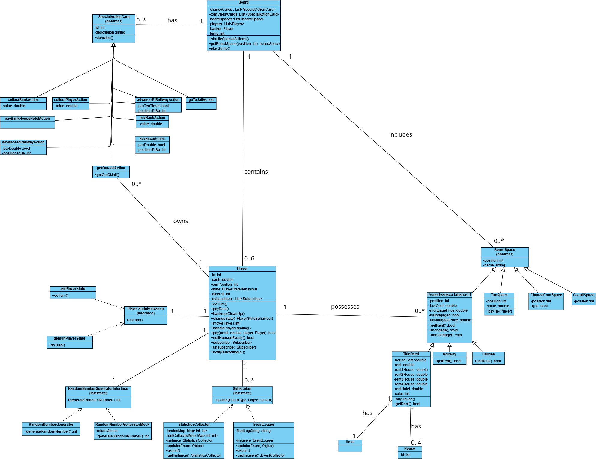
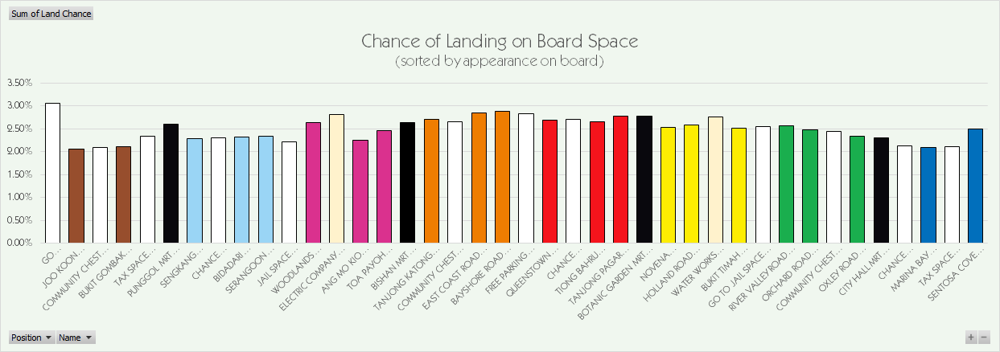
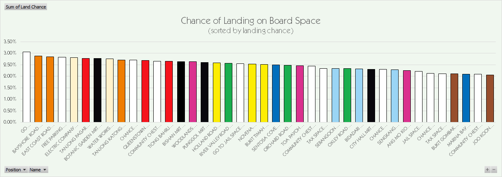
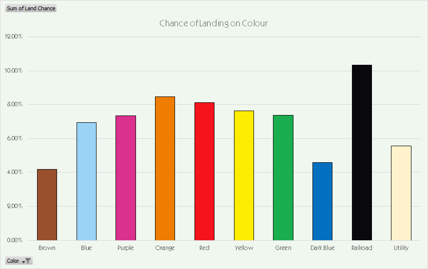

# Java Monopoly
A Java implementation of the hyper-realistic popular capitalistic boardgame-cum-bankruptcy-simulator, Monopoly.

## Why?
I couldn't find (or didn't bother to find) any statistics on the best properties to buy during monopoly. I want to win Monopoly. I want to be rich. CEO Mindset. Therefore I decided to create a simulation of the game, so that I could run and find the properties that gain the most money in the long run.

## But I literally found the best properties pieces to buy right [here](https://www.monopolyland.com/the-best-monopoly-properties-to-buy/)? 
Big media is lying to you.


# Implementation
## Class Diagram


## How to run?
If you want to change parameters of the simulation:

Clone the repository, and use ```gradlew run``` in the cli at the project dir.

If you just want to run it locally:

Download the build in the github releases, and run the .bat or .sh or whatever pertaining to your distribution

## Why would I want to do this?
To get your own data. The program runs simulations of the game, and at the end outputs a .csv of data. The data collected includes where players land, and how much rent is paid at each space in the board.

## I want more data!
Create your own data collector class that implements the ```subscriber``` interface, subscribe it to the relevant class, and log virtually any data you want. Feel free to fork or make a PR if you care.

# Constraints
## Developer stupidity
I don't know how to do game AI. So the players of the game don't buy houses or unmortgage their property.

However, there is functionality to do so.

# Data & Conclusions
## Methodology
Simulations were run for 1000 turns for 100 separate games. The data was collated from every game.

## Graphs


Players land more frequently in the middle area of the board



GO is the board space most landed on, followed by 2 orange spaces, bayshore & east coast. Bayshore was landed on 2.88% of the time, in the 100,000 turns ran.



For the color sets, the most frequently landed on set was the railroads. This is followed by orange, red, and yellow. Brown was the least-landed on property.

## [Monopolyland](https://www.monopolyland.com/the-best-monopoly-properties-to-buy/)  was right?
Orange does seem to be a good property to buy due to the relatively high landings and price. Dark blue also nets a lot of rent, specifically sentosa cove. This is due to the high base rent of sentosa cove.

Railroads are landed on quite frequently, and it may be a good strategy to psyop your friends into believing railroads are trash, and then buying the railroads from them.


## Final Words
The man who believes that the secrets of the world are forever hidden lives in mystery and fear. Superstition will drag him down. The rain will erode the deeds of his life. But that man who sets himself the task of singling out the thread of order from the tapestry will by the decision alone have taken charge of the world and it is only by such taking charge that he will effect a way to dictate the terms of his own fate. Monopoly will be won.

## TL;DR
Buy orange, red, yellow, railroads too I guess?